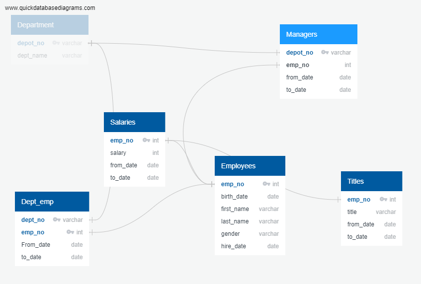

# Pewlett-Hackard-Analysis
## Project Overview##
Pewlett-Hackard-Analysis, we learned about data modeling engineering, and analysis. We created entity relationship diagrams (ERDs), imported data into a database, troubleshot common errors, created queries and joint tables that use data to answer questions using SQL techniques.

##Resources## 
The Pewlett-Hackard-Analysis module uses PostgreSQL which required pgAdmin to be installed. Visit the PostgresSQL [download website] https://www.enterprisedb.com/downloads/postgres-postgresql-downloads to initiate your download.

* Resources: departments.csv, dept_emp.csv, dept_manager.csv, employees.csv, salaries.csv, titles.csv
* ftware: Postgres, pgAdmin
For more about PostgreSQL, see:

The PostgreSQL documentation https://www.postgresql.org/docs/manuals/
The PostgreSQL tutorial https://www.tutorialspoint.com/postgresql/

##Objectives## 
* Design an ERD that applies to the data.
* Create and use a SQL database.
* Import and export large CSV datasets into pgAdmin.
* Practice using different joins to create new tables in pgAdmin.
* Write basic- to intermediate-level SQL statements.

##Summary## 

##EmployeeDB ERD## 

##Challenge Overview## 

* Use an ERD to understand relationships between SQL tables.
* Create new tables in pgAdmin by using different joins.
* Write basic- to intermediate-level SQL statements.
* Export new tables to a CSV file.

##Challenge Summary##
